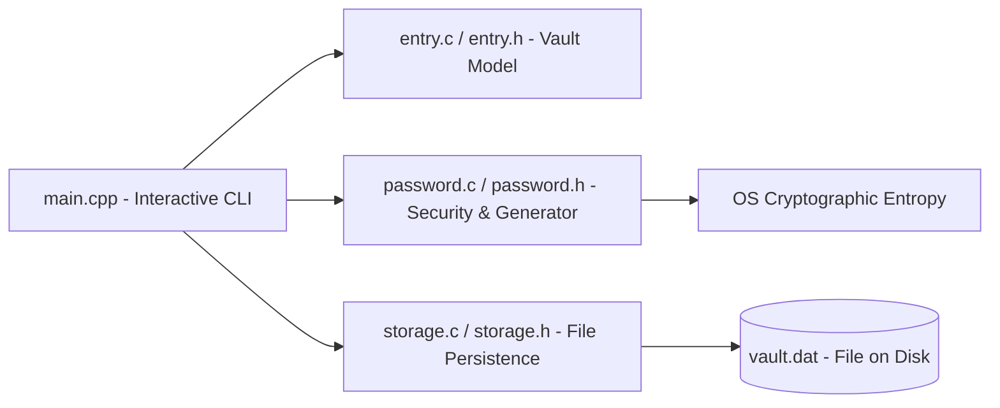

# Requirements

### Overview & Goals
`kehl-vault` is a lightweight password manager written in C/C++. The primary objective is to maximize long-term practical utility, data security, and operational reliability by evolving the current in-memory proof-of-concept into a dependable, feature-complete CLI vault application.

### Current State Analysis
1. **Core Data Structures (`entry.h`, `entry.c`)**:
   - Implements `Entry` (fixed-size buffers for title, username, password) and `EntryList` (dynamically resizable heap array).
   - Basic CRUD operations (create, add, get, update, remove) and console print functions are implemented and functional.
2. **Password Utilities (`password.h`, `password.c`)**:
   - Implements password rule checks (length, lower, upper, digit, special char) and composite strength scoring (0–5).
   - Contains raw byte-to-charset mapping (`password_generate_from_bytes`), but lacks a real platform entropy source.
3. **Execution & Entry Point (`main.cpp`)**:
   - Currently acts as a hardcoded sequential demo script verifying dynamic array growth and basic deletion.
   - Lacks interactive CLI capabilities, storage persistence, and integration with `password.h`.

### Scope
- **In Scope**:
  - Structured/encrypted file persistence (`save`/`load` vault data).
  - Secure random byte generation and automated password generator integration.
  - Interactive CLI command loop for CRUD management and search.
  - Comprehensive automated test coverage for core components.
- **Out of Scope (Current Iteration)**:
  - Cloud synchronization and multi-device networking.
  - Graphical User Interface (GUI).
  - Browser extensions or autofill hooks.

### User Stories
- **US-1**: As a user, I want my vault entries to persist to disk so that my stored credentials are not lost when closing the application.
- **US-2**: As a user, I want an interactive terminal menu so that I can conveniently add, view, update, search, and delete entries.
- **US-3**: As a user, I want the application to evaluate password strength and generate strong passwords so that my accounts remain secure.
- **US-4**: As a developer/maintainer, I want automated tests to prevent regressions in storage, memory management, and password scoring.

### Functional Requirements
- **FR-1**: The system must persist `EntryList` data to disk using a consistent serialization format.
- **FR-2**: The CLI must provide an interactive loop with clear menus: list entries, add entry, find entry, edit entry, delete entry, and exit.
- **FR-3**: The system must support generating passwords of configurable length with custom or default character sets.
- **FR-4**: The system must report password strength (Weak, Medium, Strong) whenever a user inputs or generates a password.
- **FR-5**: Memory allocations must be leak-free and validated against edge cases (empty lists, invalid indices, corrupted save files).

### Non-Functional Requirements
- **Reliability & Safety**: Prevent buffer overflows via strict bounds checking (`strncpy` / bounded buffers).
- **Performance**: Vault operations must execute in under 10ms for typical databases (up to 10,000 entries).
- **Portability**: Maintain clean C/C++ cross-platform compatibility across Windows and POSIX environments.

# Technical Design

### Current Implementation
- `entry.c` / `entry.h`: Provides standard dynamic array reallocation (`capacity * 2`) and fixed buffer sizes (64 chars each for title, username, password).
- `password.c` / `password.h`: Standalone rule checkers and byte-mapping logic.
- `main.cpp`: Procedural demo testing `entry_list_*` operations.

### Key Decisions
1. **Separation of Concerns**:
   - Keep data structures and core algorithmic logic in pure C (`entry.c`, `password.c`, `storage.c`) to maintain low overhead, high portability, and zero external runtime dependencies.
   - Utilize C++ in `main.cpp` / CLI presentation layer for streamlined I/O handling and user interactions.
2. **Storage Architecture**:
   - Introduce a dedicated `storage.c` / `storage.h` module responsible for atomic file writes (write to temporary file, flush, rename) to eliminate data corruption risks during power or process interruption.
3. **Entropy Source**:
   - Utilize OS-level cryptographically secure random sources (`BCryptGenRandom` on Windows, `/dev/urandom` on POSIX) rather than standard pseudo-random `rand()`.

### Proposed Changes & Module Architecture



### Components
- **`entry` (Existing, Extended)**: Manages `Entry` structures, list resizing, filtering, and indexing.
- **`password` (Existing, Extended)**: Evaluates rule-based scores, entropy-based generation, and charset definitions.
- **`storage` (New)**: Handles file format headers, magic bytes, entry serialization, deserialization, and atomic disk writes.
- **`cli / main` (Updated)**: Terminal loop, command parsing, formatted table printing, and prompt dialogs.

### File Structure
```
kehl-vault/
├── CMakeLists.txt         # Build definitions and test targets
├── entry.h / entry.c      # In-memory vault data structures
├── password.h / password.c# Password validation and generation
├── storage.h / storage.c  # (New) Vault disk persistence
├── main.cpp               # Interactive CLI interface
└── tests/                 # (New) Unit and integration test suite
    └── test_vault.cpp
```

### Data Models & File Format Contract
```c
typedef struct {
    uint32_t magic;         // 0x564B4548 ("KEHV")
    uint32_t version;       // Version identifier (e.g., 1)
    uint32_t entry_count;   // Total entries stored
} VaultHeader;
```

### Risks & Mitigations
- **Data Loss on Partial Writes**: Mitigated by atomic temporary file swapping (`tmp` file write -> flush -> rename).
- **Buffer Truncation**: Mitigated by uniform size constants (`ENTRY_TITLE_SIZE`, etc.) and explicit null-termination guards across all read/write paths.

# Testing

### Validation Approach
Verification focuses on maximizing reliability and data integrity through systematic automated unit tests, memory leak profiling, and boundary analysis.

### Key Scenarios
1. **Dynamic Expansion & Memory Stability**:
   - Add items exceeding initial capacity to trigger multiple reallocations.
   - Validate pointer validity and verify clean destruction with zero memory leaks.
2. **Persistence Integrity**:
   - Initialize vault, add entries, save to disk, reload in a clean instance, and assert all fields are identical.
   - Verify handling of missing, empty, or truncated vault files.
3. **Password Generation & Strength Scoring**:
   - Validate character distribution across generated passwords.
   - Verify strength score grading against known test vectors (e.g., all-lowercase, short passwords, complex mixed strings).
4. **CRUD Boundary Conditions**:
   - Attempt retrieval or deletion of negative or out-of-range indices.
   - Verify that removing the first, middle, or last entry maintains correct array compactness.

### Test Matrix
| Area | Test Case | Expected Outcome |
| :--- | :--- | :--- |
| **Entry** | Add beyond initial capacity | Automatic doubling of capacity, all entries preserved |
| **Entry** | Remove out of bounds (e.g. index 99) | Graceful rejection (`return 0`), count unmodified |
| **Storage** | Save and reload 100 entries | Exact match of titles, usernames, and passwords |
| **Storage** | Corrupted header detection | Loading safely aborted with descriptive error code |
| **Password**| Strength evaluation | Correct score computation matching rule satisfaction |
| **Password**| Generator bounds | Generated password conforms to requested length and charset |

# Delivery Steps

### ✓ Step 1: Implement persistent vault file storage
Enable encrypted or structured file serialization so entry data persists across application restarts.

- Implement vault file format header and payload structures in a new `storage.h` / `storage.c` module.
- Add `vault_save_to_file` and `vault_load_from_file` supporting safe binary or structured text serialization.
- Ensure error handling for missing files, corrupted bytes, and permission issues.
- Connect memory management to ensure all loaded entries cleanly deallocate on shutdown.

### ✓ Step 2: Integrate password generation and strength validation
Expose a cryptographically secure random number generator and integrate password generation into vault workflows.

- Implement secure random byte generation on Windows/POSIX platforms (e.g. `BCryptGenRandom` or platform entropy source) to feed `password_generate_from_bytes`.
- Create helper functions for standard password generation profiles (length, special characters, uppercase, digits).
- Hook `password_calculate_strength` and validation checks when creating or updating entries.

### ✓ Step 3: Develop interactive CLI user interface
Replace the hardcoded demo flow in `main.cpp` with an interactive menu and command-driven console interface.

- Implement a main loop providing options: List all entries, Search entry by title, Add entry (with optional generator), Edit entry, Delete entry, Save & Exit.
- Add input sanitization and secure password masking for terminal inputs where supported.
- Integrate validation feedback, showing real-time password strength indicators to the user.

### ✓ Step 4: Implement automated test suite and edge case validation
Establish a test suite and error handling verification across all vault operations.

- Create automated unit and integration tests for `EntryList` boundary conditions (resizing, empty lists, index out of bounds).
- Test storage persistence integrity (save, reload, verify byte-for-byte correctness).
- Validate password generation entropy distribution and strength scoring correctness.

### ✓ Step 5: Implement master password protection and vault encryption
Secure stored credentials with master password verification and encryption at rest.

- Implement cryptographic key derivation / hashing (e.g. PBKDF2/SHA-256 or secure block cipher / ChaCha20/XChaCha20 or AES/authenticated stream cipher).
- Upgrade `VaultHeader` with salt and validation hash/tag to verify master password on load.
- Ensure corrupted or incorrect passwords gracefully reject access without leaking plaintext.

### ✓ Step 6: Add safe password masking and clipboard integration
Enhance security during terminal interactions and credential retrieval.

- Mask passwords by default in listing views (e.g., `••••••••`) with an option to reveal.
- Add secure clipboard copy on Windows (`OpenClipboard` / `SetClipboardData`) and POSIX.
- Implement masked console input for master password and new passwords.

### ✓ Step 7: Add vault security audit and duplicate detection
Provide users with proactive security analysis of their stored credentials.

- Add audit routine scanning for weak passwords (score < 3) and duplicate passwords across entries.
- Display an interactive health report in the CLI with actionable improvement hints.
- Add automated unit tests verifying audit metrics.

### ✓ Step 8: Implement CSV / JSON export and import
Allow backup, migration, and interoperability with other password managers.

- Add formatted CSV export/import handling delimiters, headers, and quoted strings.
- Add JSON export/import for structured backup.
- Validate safety and bounds checking against malformed import files.

### ✓ Step 9: Implement Diceware multi-word passphrase generator
Extend password generator capabilities with human-memorable multi-word passphrases.

- Embed a curated wordlist in the generator module.
- Implement random word selection using OS entropy source.
- Add passphrase generation option in the CLI with custom separators (e.g., hyphens, dots).

### ✓ Step 10: Create comprehensive codebase documentation and code explanation
Author an in-depth Markdown documentation explaining the complete codebase architecture and inter-module connections.

- Create `CODEBASE_DOCUMENTATION.md` detailing every module (`entry`, `password`, `storage`, `main`, `tests`).
- Map out the system lifecycle, cryptographic design, memory management invariants, and error handling strategies.
- Provide step-by-step connection summaries linking all implemented roadmap phases.