# Kehl-Vault – Comprehensive Codebase & Architecture Documentation

`kehl-vault` is a high-performance, modular, and cross-platform command-line password manager (CLI Vault) implemented in standard C (C17) and C++ (C++20). The system is designed with zero external runtime dependencies, strict memory safety guarantees, and industry-standard authenticated encryption.

---

## 1. System Overview & Module Architecture

The codebase strictly enforces the **Separation of Concerns** principle:
- **Core algorithmic, cryptographic, and persistence logic (`.c`/`.h`)**: Implemented in portable, lightweight C (C17) for zero runtime overhead and predictable memory layouts.
- **Presentation and interactive console layer (`main.cpp`)**: Implemented in C++ (C++20) for structured user interaction, masked input handling, and terminal flow control.

```mermaid
graph TD
    User([User / CLI Terminal]) <--> Main[main.cpp - Presentation & Command Loop]
    
    subgraph Core Data & Taxonomy
        Main --> Entry[entry.c / entry.h - Dynamic Memory & Models]
        Main --> Cat[category.c / category.h - Categories & Tag Filtering]
        Main --> Hist[history.c / history.h - Change Log & Trash Bin]
    end

    subgraph Security & Cryptography
        Main --> Pass[password.c / password.h - Password Security & Passphrases]
        Main --> Crypto[crypto.c / crypto.h - SHA-256, HMAC, PBKDF2, ChaCha20]
        Main --> Totp[totp.c / totp.h - RFC 6238 2FA Generator]
        Main --> SecMem[secure_mem.c / secure_mem.h - Volatile Memory Scrubbing]
    end

    subgraph Storage & Backup
        Main --> Storage[storage.c / storage.h - Authenticated Encrypted I/O]
        Main --> Backup[backup.c / backup.h - Snapshot Creation & Rotation]
        Main --> Profile[profile.c / profile.h - Multi-Vault Database Switcher]
        Main --> Impex[impex.c / impex.h - RFC 4180 CSV & JSON Impex]
        Storage --> VaultFile[(vault.dat - Encrypted Database)]
    end

    subgraph Utilities & Analysis
        Main --> Clip[clipboard.c / clipboard.h - Secure System Clipboard]
        Main --> Audit[audit.c / audit.h - Security Audit & Duplicate Detection]
        Main --> Expiry[expiry.c / expiry.h - Expiration & Age Tracking]
        Main --> Search[search.c / search.h - Fuzzy Levenshtein Ranking]
    end
```



---

## 2. Detailed Module Breakdown

### 2.1 In-Memory Data Structures: `entry.h` & `entry.c`
Manages in-memory credential storage:
- **`Entry`**: Fixed-size credential record (`ENTRY_TITLE_SIZE = 64`, `ENTRY_USERNAME_SIZE = 64`, `ENTRY_PASSWORD_SIZE = 64`). Guarantees bounded copies and explicit null termination.
- **`EntryList`**: Resizable dynamic heap array (`entries`, `count`, `capacity`).
- **Growth Policy**: Automatically doubles capacity via `realloc` when `count >= capacity`.
- **Compaction**: `entry_list_remove` uses `memmove` to close array gaps seamlessly.

---

### 2.2 Cryptographic Primitives: `crypto.h` & `crypto.c`
Provides self-contained cryptographic algorithms compliant with official RFC standards:
1. **SHA-256 (RFC 6234)**: Cryptographic 256-bit hashing primitive.
2. **HMAC-SHA256 (RFC 2104)**: Keyed-hash message authentication.
3. **PBKDF2-HMAC-SHA256 (RFC 2898)**: Key derivation function with 100,000 iterations to resist brute-force attacks.
4. **ChaCha20 (RFC 8439)**: High-speed 256-bit stream cipher with 96-bit nonces.
5. **`crypto_constant_time_equals`**: Constant-time comparison avoiding timing side-channel attacks.

---

### 2.3 Storage & Persistence: `storage.h` & `storage.c`
Serializes and deserializes the vault with Authenticated Encryption:
- **Header Structure**:
  ```c
  typedef struct {
      uint32_t magic;                            // 0x564B4548 ("KEHV")
      uint32_t version;                          // 1 = plain, 2 = encrypted
      uint32_t entry_count;                      // Number of records
      uint8_t  salt[CRYPTO_SALT_SIZE];           // PBKDF2 random salt
      uint8_t  nonce[CRYPTO_NONCE_SIZE];         // ChaCha20 random nonce
      uint8_t  auth_tag[CRYPTO_SHA256_HASH_SIZE];// HMAC-SHA256 authentication tag
  } VaultHeader;
  ```
- **Encrypt-then-MAC**: Derives two distinct 32-byte keys (`enc_key` and `auth_key`) via PBKDF2. Encrypts payload with ChaCha20, then authenticates ciphertext with HMAC-SHA256.
- **Atomic Writes**: Writes first to temporary file (`.tmp`), flushes, closes, and renames atomatically to prevent corruption during unexpected shutdowns.

---

### 2.4 Password Generation & Security: `password.h` & `password.c`
- **Strength Evaluation (`password_calculate_strength`)**: Scores 0 to 5 based on length, lowercase, uppercase, digits, and special characters.
- **OS Cryptographic Entropy (`password_get_secure_random_bytes`)**: Uses `BCryptGenRandom` on Windows and `/dev/urandom` on POSIX.
- **Diceware Passphrase Generator (`password_generate_passphrase`)**: Assembles memorable multi-word passphrases from a curated 256-word dictionary.

---

### 2.5 Multi-Profile Management: `profile.h` & `profile.c`
- Manages isolated vaults (e.g., `vault.dat`, `vault_work.dat`, `vault_finance.dat`).
- Discovers existing databases in the working directory and allows switching without restarting.

---

### 2.6 Categorization & Tagging: `category.h` & `category.c`
- Standard category definitions (`Login`, `Card`, `Secure Note`, `Identity`, `Other`).
- Fast tag parsing and case-insensitive matching for multi-tag workflows.

---

### 2.7 Two-Factor Authentication (TOTP): `totp.h` & `totp.c`
- RFC 6238 and RFC 4226 compliant 6-digit rolling code generator.
- Base32 decoding, HMAC-SHA1 calculation, and 30-second time-step interval tracking.

---

### 2.8 Change History & Trash Bin: `history.h` & `history.c`
- Maintains in-memory historical logs of modified and deleted records.
- Soft-deletion allows restoring accidentally deleted entries back to the active vault.

---

### 2.9 Password Age & Expiration Tracking: `expiry.h` & `expiry.c`
- Evaluates password freshness against configurable rotation policies (30, 60, 90, 180, 365 days).
- Identifies expiring-soon and expired credentials requiring rotation.

---

### 2.10 Automated Backup Snapshots: `backup.h` & `backup.c`
- Creates timestamped encrypted copies (`.bak_<timestamp>`) prior to destructive saves.
- Automatically rotates and prunes old snapshots to retain the newest 10 backups.

---

### 2.11 Fuzzy Search & Ranking Engine: `search.h` & `search.c`
- Combines exact match, prefix, substring, and Levenshtein edit distance calculations.
- Weighted multi-field ranking across entry titles and usernames.

---

### 2.12 Secure Memory Wiping: `secure_mem.h` & `secure_mem.c`
- Uses `SecureZeroMemory` on Windows and volatile scrubbing on POSIX.
- Guarantees sensitive plaintext credentials, derived encryption keys, and buffers are wiped from RAM before deallocation.

---

### 2.13 System Clipboard: `clipboard.h` & `clipboard.c`
- Direct copying to system clipboard (Win32 API on Windows, `wl-copy`/`xclip`/`pbcopy` on POSIX).

---

### 2.14 Security Audit: `audit.h` & `audit.c`
- Scans for duplicate passwords across entries and computes a comprehensive health score (0–100%).

---

### 2.15 Import & Export: `impex.h` & `impex.c`
- RFC 4180-compliant CSV and structured JSON import/export.

---

## 3. The 20 Delivery Steps & Architectural Mapping

| Step | Phase / Feature | Architecture Summary |
| :--- | :--- | :--- |
| **Step 1** | *Storage Persistence* | Added `storage.c/h`, `VaultHeader`, binary serialization, and atomic writes. |
| **Step 2** | *Password Generation* | Integrated OS cryptographic entropy (`BCryptGenRandom`/`/dev/urandom`) into `password.c/h`. |
| **Step 3** | *Interactive CLI* | Replaced procedural demo in `main.cpp` with an interactive command loop. |
| **Step 4** | *Automated Test Suite* | Established unit test harness in `tests/test_vault.cpp`. |
| **Step 5** | *Master Password & Encryption* | Built `crypto.c/h` (SHA-256, PBKDF2, ChaCha20, HMAC) for version 2 encrypted vault files. |
| **Step 6** | *Masking & Clipboard* | Implemented `clipboard.c/h` and masked console password inputs. |
| **Step 7** | *Security Audit* | Created `audit.c/h` for duplicate password detection and health scoring. |
| **Step 8** | *CSV & JSON Impex* | Created `impex.c/h` for cross-platform backup and interoperability. |
| **Step 9** | *Diceware Passphrases* | Added multi-word passphrase generation to `password.c/h`. |
| **Step 10** | *Documentation (Part 1)* | Authored initial codebase architecture documentation. |
| **Step 11** | *Multi-Vault Profiles* | Added `profile.c/h` for isolated database files and profile switching. |
| **Step 12** | *Categorization & Tags* | Added `category.c/h` for entry classification and tag parsing. |
| **Step 13** | *TOTP 2FA Authenticator* | Implemented RFC 6238 Base32 and HMAC-SHA1 2FA generator in `totp.c/h`. |
| **Step 14** | *History & Trash Bin* | Added `history.c/h` for change logging and soft-delete entry recovery. |
| **Step 15** | *Password Expiry Tracking* | Added `expiry.c/h` for credential age evaluation and rotation policies. |
| **Step 16** | *Encrypted Snapshots* | Added `backup.c/h` for automated snapshot creation and backup rotation. |
| **Step 17** | *Fuzzy Search Engine* | Added `search.c/h` with Levenshtein distance and weighted multi-field ranking. |
| **Step 18** | *Secure Memory Wiping* | Added `secure_mem.c/h` for compiler-safe zeroization of sensitive memory. |
| **Step 19** | *Codebase Comment Refactor* | Thorough English comments and documentation across all files. |
| **Step 20** | *Test Expansion & Git Push* | Comprehensive automated test validation across all 20 modules and remote sync. |

---

## 4. Build, Test & Run Instructions

### 4.1 Build Project
```bash
cmake -B cmake-build-debug -G Ninja
cmake --build cmake-build-debug
```

### 4.2 Run Automated Tests
```bash
./cmake-build-debug/test_vault.exe
```

### 4.3 Launch CLI Application
```bash
./cmake-build-debug/kehl_vault.exe
```
