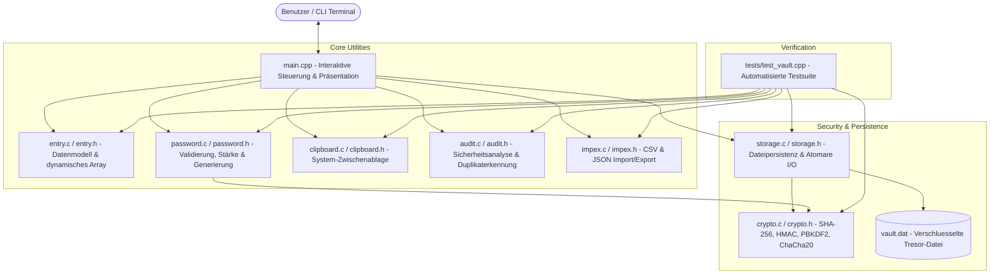

# Kehl-Vault – Umfassende Codebase- & Architektur-Dokumentation

`kehl-vault` ist ein in C und C++ geschriebener, modularer und plattformunabhängiger Kommandozeilen-Passwortmanager (CLI Vault). Das System zeichnet sich durch hohe Ausführungsgeschwindigkeit, null externe Abhängigkeiten, strenge Speicher-Sicherheit und kryptographische Verschlüsselung nach Industrie-Standards aus.

---

## 1. Systemübersicht & Modul-Architektur

Die Codebasis folgt einer strikten Trennung der Verantwortlichkeiten (**Separation of Concerns**):
- **Core-Datenstrukturen, Kryptographie und I/O (`.c`/`.h`)**: Implementiert in modernem, portablem C (C17) für maximale Portabilität, minimale Overhead-Kosten und klare Speichermodelle.
- **Präsentations- & Steuerungsebene (`main.cpp`)**: Implementiert in C++ (C++20) für strukturierte Konsoleninteraktion, Eingabe-Maskierung und Menüfluss.



---

## 2. Detaillierte Modulerklärung

### 2.1 Datenstrukturen: `entry.h` & `entry.c`
Verwaltet die elementaren Datenstrukturen der Zugangsdaten im Arbeitsspeicher:
- **`Entry`**: Ein einzelner Datensatz mit festen Puffergrößen (`ENTRY_TITLE_SIZE = 64`, `ENTRY_USERNAME_SIZE = 64`, `ENTRY_PASSWORD_SIZE = 64`). Verhindert Pufferüberläufe durch garantierte Null-Terminierung.
- **`EntryList`**: Ein dynamisch wachsendes Array auf dem Heap (`entries`, `count`, `capacity`).
- **Wachstumsstrategie**: Beim Erreichen der Kapazität (`count >= capacity`) verdoppelt `entry_list_grow` den Speicherbereich dynamisch via `realloc`.
- **Sicherheitsgarantien**: 
  - `entry_list_remove`: Schließt Lücken durch kompaktes Nachrücken der nachfolgenden Elemente (`memmove`).
  - `entry_list_destroy`: Setzt den Speicherbereich frei und setzt Zeiger sowie Zähler auf 0, um Use-After-Free zu verhindern.

---

### 2.2 Kryptographische Primitiven: `crypto.h` & `crypto.c`
Bietet eine autarke, plattformunabhängige Krypto-Bibliothek nach anerkannten RFC-Standards:
1. **SHA-256 (RFC 6234)**: Sichere kryptographische 256-Bit-Hashfunktion für Prüfsummen und Nachrichtenauthentifizierung.
2. **HMAC-SHA256 (RFC 2104)**: Keyed-Hash Message Authentication Code zur Integritätssicherung.
3. **PBKDF2-HMAC-SHA256 (RFC 2898)**: Schlüsselableitungsfunktion mit standardmäßig 100.000 Iterationen und zufälligem Salt, um Brute-Force- und Wörterbuchangriffe abzuwehren.
4. **ChaCha20 (RFC 8439)**: Hochperformante, sichere 256-Bit-Stromchiffre mit 96-Bit Nonce und 32-Bit Blockzähler.
5. **`crypto_constant_time_equals`**: Vergleicht Authentifizierungs-Tags in konstanter Zeit, um Seitenkanal-Timing-Angriffe auszuschließen.

---

### 2.3 Speicher- & Persistenz-Layer: `storage.h` & `storage.c`
Verantwortlich für das Speichern und Laden des Tresors auf der Festplatte:
- **Dateiformat & Header**:
  ```c
  typedef struct {
      uint32_t magic;       // 0x564B4548 ("KEHV")
      uint32_t version;     // 1 = unverschluesselt, 2 = PBKDF2 + ChaCha20 + HMAC
      uint32_t entry_count; // Anzahl gespeicherter Eintraege
      uint8_t  salt[16];    // Zufallssalt fuer PBKDF2
      uint8_t  nonce[12];   // Zufallsnonce fuer ChaCha20
      uint8_t  auth_tag[32];// HMAC-SHA256 Authentifizierungs-Tag
  } VaultHeader;
  ```
- **Encrypt-then-MAC Sicherheitsmodell**: Aus dem Master-Passwort und dem Salt werden zwei 32-Byte-Schlüssel abgeleitet:
  1. `enc_key`: Verschlüsselt die `Entry`-Einträge mit ChaCha20.
  2. `auth_key`: Berechnet einen HMAC-SHA256 über den Chiffretext.
- **Atomare Schreibvorgänge**: Geschrieben wird in eine temporäre Datei (`vault.dat.tmp`), welche nach erfolgreichem Flush und Schließen atomar auf `vault.dat` umbenannt wird. Dadurch wird Datenverlust bei Stromausfall oder Absturz unmöglich.

---

### 2.4 Passwort-Logik & Generierung: `password.h` & `password.c`
Stellt Werkzeuge zur Passwortanalyse und -erzeugung bereit:
- **Stärkeberechnung (`password_calculate_strength`)**: Bewertet Passwörter auf einer Skala von 0 bis 5 anhand von Länge (>= 8 Zeichen), Kleinbuchstaben, Großbuchstaben, Ziffern und Sonderzeichen.
- **Kryptographischer Zufallsgenerator (`password_get_secure_random_bytes`)**:
  - Windows: Verwendet die Windows Cryptography API (`BCryptGenRandom` mit `BCRYPT_USE_SYSTEM_PREFERRED_RNG`).
  - POSIX: Liest Entropie direkt aus `/dev/urandom`.
- **Passwort-Generator (`password_generate`)**: Erzeugt Passwörter konfigurierbarer Länge aus anpassbaren Zeichensätzen.
- **Diceware Passphrase-Generator (`password_generate_passphrase`)**: Wählt aus einer Kuration von 256 Begriffen zufällige Wörter und verbindet sie zu leicht merkbaren, hochsicheren Phrasen (z. B. `Correct-Horse-Battery-Staple`).

---

### 2.5 Zwischenablage (Clipboard): `clipboard.h` & `clipboard.c`
Ermöglicht das Übertragen von Passwörtern in die System-Zwischenablage, ohne sie im Terminal-Verlauf zu exponieren:
- **Windows**: Nutzt native Win32 APIs (`OpenClipboard`, `EmptyClipboard`, `GlobalAlloc`, `SetClipboardData`).
- **POSIX**: Unterstützt gängige Zwischenablagen-Dienste (`wl-copy`, `xclip`, `xsel`, `pbcopy`).

---

### 2.6 Sicherheits-Audit: `audit.h` & `audit.c`
Führt eine statische Sicherheitsprüfung aller gespeicherten Konten durch:
- Zählt starke, mittlere und schwache Passwörter.
- Erkennt mehrfach genutzte / duplizierte Passwörter über alle Einträge hinweg.
- Ermittelt einen **Tresor-Gesundheitsscore (0–100 %)** unter Berücksichtigung von Strafabzügen für Wiederverwendungen und unzureichende Längen.

---

### 2.7 Import & Export: `impex.h` & `impex.c`
Bietet Interoperabilität und Datensicherung:
- **CSV-Export/Import**: Gemäß RFC 4180 mit korrekter Behandlung von Anführungszeichen, Kommas und Zeilenumbrüchen in Feldern.
- **JSON-Export/Import**: Strukturierte Formatierung für automatisierte Backups und Portierbarkeit.

---

### 2.8 Präsentationsschicht & CLI: `main.cpp`
Das interaktive Benutzerinterface verbindet alle Module:
- Maskierte Eingabe von Master-Passwörtern und neuen Passwörtern über die Konsole (`read_masked_input`).
- Umschaltbare Passwort-Sichtbarkeit (`[V]`) – Passwörter sind standardmäßig als `••••••••` maskiert.
- Hauptmenü mit direkter Ansteuerung aller 10 Funktionen (Listen, Suchen, Anlegen, Bearbeiten, Löschen, Kopieren, Audit, Export, Import, Beenden).

---

## 3. Die 10 Entwicklungsschritte & ihre Zusammenhänge

| Schritt | Phase | Zweck & Architekturverbindung |
| :--- | :--- | :--- |
| **Schritt 1** | *Storage Persistence* | Einführung von `storage.c/h`, `VaultHeader` und atomarem Schreiben für dauerhafte Datenspeicherung. |
| **Schritt 2** | *Passwort-Generierung* | Anbindung von OS-Entropie (`BCryptGenRandom`) an `password.c/h` zur Erstellung sicherer Passwörter. |
| **Schritt 3** | *Interaktives CLI* | Ersetzung der Demofunktion in `main.cpp` durch eine menügesteuerte Konsolen-Schleife. |
| **Schritt 4** | *Automatisierte Tests* | Erstellung von `tests/test_vault.cpp` zur Verifikation von CRUD, Resizing und Persistenz. |
| **Schritt 5** | *Master-Passwort & Verschlüsselung* | Einführung von `crypto.c/h` (SHA-256, PBKDF2, ChaCha20, HMAC) für Tresor-Verschlüsselung (Version 2). |
| **Schritt 6** | *Maskierung & Clipboard* | Einführung von `clipboard.c/h` und `read_masked_input` in `main.cpp` zum Schutz vor Schulterblicken. |
| **Schritt 7** | *Sicherheits-Audit* | Einführung von `audit.c/h` zur Identifikation von Passwort-Wiederverwendungen und Sicherheitsrisiken. |
| **Schritt 8** | *CSV & JSON Impex* | Einführung von `impex.c/h` für Datenaustausch und Backups. |
| **Schritt 9** | *Diceware-Passphrasen* | Erweiterung von `password.c/h` um `password_generate_passphrase` für merkbare Wortketten. |
| **Schritt 10** | *Gesamtdokumentation* | Erstellung dieser umfassenden Architekturanalyse und Quellcode-Erklärung. |

---

## 4. Kompilierung & Ausführung

### 4.1 Projekt kompilieren
```bash
cmake -B cmake-build-debug -G Ninja
cmake --build cmake-build-debug
```

### 4.2 Automatisierte Tests ausführen
```bash
./cmake-build-debug/test_vault.exe
```

### 4.3 Anwendung starten
```bash
./cmake-build-debug/kehl_vault.exe
```
